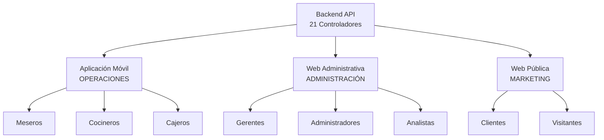

# Distribución Frontend Completa - RestaurantePro
## 3 Proyectos Frontend Especializados

---

## 📋 **INFORMACIÓN DEL DOCUMENTO**
- **Objetivo**: Definir correctamente el alcance de cada proyecto frontend
- **Proyectos**: 3 frontend especializados con propósitos distintos
- **Estrategia**: Separación clara de responsabilidades por contexto de uso

---

## 🎯 **VISIÓN GENERAL DE LOS 3 PROYECTOS**



---

## 📱 **1. APLICACIÓN MÓVIL - OPERACIONES DEL RESTAURANTE**

### **🎯 Propósito Principal**
**"El CORE operativo del restaurante"** - Gestión de comandas, mesas y operaciones diarias del personal en tiempo real.

### **👥 Usuarios Objetivo**
- **Meseros** (principales)
- **Cocineros** 
- **Cajeros**
- **Supervisores de turno**

### **✅ FUNCIONALIDADES INCLUIDAS (Críticas Operativas)**

#### **A. Contexto Operaciones (COMPLETO)**
```csharp
// Controladores 100% incluidos en Mobile
✅ ComandasController          // CORE - Gestión de comandas
✅ MesasController            // CORE - Estados de mesas
✅ ReservacionesController    // Consulta y confirmación
✅ PreparacionesController    // Estados de cocina
```

#### **B. Contexto Core (PARCIAL - Solo operativo)**
```csharp
✅ ProductosController        // Solo consulta para menú
✅ AuthController            // Autenticación del personal
❌ UsuariosController        // VA A WEB ADMINISTRATIVA
❌ NotificacionesController  // Solo recepción, no gestión
❌ RecetasController         // VA A WEB ADMINISTRATIVA
```

#### **C. Contexto Comercial (PARCIAL - Solo venta)**
```csharp
✅ FacturasController        // Solo generar facturas de venta
✅ ClientesController        // Solo consulta básica para comandas
✅ TarjetasFidelizacionController  // Solo consulta y uso
❌ PromocionesController     // Solo consulta, VA A WEB ADMINISTRATIVA
❌ ReportesComercialController // VA A WEB ADMINISTRATIVA
```

#### **D. Contexto Inventario (MÍNIMO - Solo consulta)**
```csharp
✅ IngredientesController    // Solo consulta de disponibilidad
❌ MovimientosInventarioController  // VA A WEB ADMINISTRATIVA
❌ OrdenesCompraController   // VA A WEB ADMINISTRATIVA  
❌ ReportesInventarioController // VA A WEB ADMINISTRATIVA
```

#### **E. Contexto Proveedores (EXCLUIDO)**
```csharp
❌ ProveedoresController     // VA A WEB ADMINISTRATIVA
❌ ContactosProveedor        // VA A WEB ADMINISTRATIVA
```

### **📱 FLUJOS MOBILE REFINADOS**

#### **Flujos CORE (Obligatorios)**
1. **Flujo de Atención al Cliente**
2. **Flujo de Tomar Orden**
3. **Flujo de Preparación (Cocina)**
4. **Flujo de Facturación (Venta)**
5. **Flujo de Liberación de Mesa**

#### **Flujos de SOPORTE (Secundarios)**
1. **Consulta de Menú/Productos**
2. **Consulta de Cliente (básica)**
3. **Verificación de Inventario**
4. **Estados de Preparación**

---

## 💻 **2. WEB ADMINISTRATIVA - ADMINISTRACIÓN Y ANÁLISIS**

### **🎯 Propósito Principal**
**"Centro de control administrativo"** - Gestión completa, reportes, análisis de datos y administración del sistema.

### **👥 Usuarios Objetivo**
- **Gerentes**
- **Administradores**
- **Propietarios**
- **Personal administrativo**

### **✅ FUNCIONALIDADES INCLUIDAS (Administración Completa)**

#### **A. Contexto Core (COMPLETO)**
```csharp
✅ ProductosController        // Gestión completa de menú
✅ UsuariosController         // Gestión de personal
✅ NotificacionesController   // Configuración y gestión
✅ RecetasController          // Gestión de recetas
```

#### **B. Contexto Comercial (COMPLETO)**
```csharp
✅ PromocionesController      // Creación y gestión de promociones
✅ ReportesComercialController // Análisis de ventas y reportes
✅ FacturasController         // Gestión completa de facturación
✅ ClientesController         // Gestión completa de clientes
✅ TarjetasFidelizacionController // Configuración programa fidelización
```

#### **C. Contexto Inventario (COMPLETO)**
```csharp
✅ IngredientesController     // Gestión completa de ingredientes
✅ MovimientosInventarioController // Historial y movimientos
✅ OrdenesCompraController    // Gestión de compras
✅ ReportesInventarioController // Análisis de inventario
```

#### **D. Contexto Proveedores (COMPLETO)**
```csharp
✅ ProveedoresController      // Gestión de proveedores
✅ ContactosProveedor         // Gestión de contactos
```

#### **E. Contexto Operaciones (ANÁLISIS)**
```csharp
✅ ReportesController         // Análisis operativo completo
⚠️ ComandasController         // Solo reportes y análisis
⚠️ MesasController           // Solo configuración
⚠️ ReservacionesController   // Gestión y reportes
⚠️ PreparacionesController   // Solo reportes
```

### **🔧 FUNCIONALIDADES EXCLUSIVAS WEB ADMIN**
1. **Dashboard Ejecutivo** con métricas avanzadas
2. **Reportes y Analytics** completos
3. **Gestión de Personal** y roles
4. **Configuración del Sistema**
5. **Gestión de Inventario** avanzada
6. **Administración de Proveedores**
7. **Configuración de Promociones**
8. **Análisis Financiero** detallado

---

## 🌐 **3. WEB PÚBLICA - MARKETING Y CLIENTES**

### **🎯 Propósito Principal**
**"Presencia digital del restaurante"** - Mostrar menú, información del negocio y captar comentarios de clientes.

### **👥 Usuarios Objetivo**
- **Clientes potenciales**
- **Visitantes del sitio web**
- **Clientes existentes**

### **✅ FUNCIONALIDADES INCLUIDAS (Públicas)**

#### **A. Contexto Core (PÚBLICO)**
```csharp
✅ ProductosController        // Solo consulta pública del menú
❌ Otros controladores        // No aplican
```

#### **B. Contexto Comercial (LIMITADO)**
```csharp
⚠️ ClientesController         // Solo registro de nuevos clientes
❌ Otros controladores        // No públicos
```

### **🌟 FUNCIONALIDADES ESPECÍFICAS WEB PÚBLICA**
1. **Presentación del Restaurante**
   - Historia y valores
   - Galería de fotos
   - Información de contacto y ubicación

2. **Menú Digital Interactivo**
   - Catálogo de productos con fotos
   - Filtros por categoría
   - Información nutricional
   - Precios (opcional)

3. **Sistema de Comentarios**
   - Reseñas de clientes
   - Valoraciones
   - Moderación de comentarios

4. **Información Operativa**
   - Horarios de atención
   - Políticas del restaurante
   - Información de reservas

5. **Integración Social**
   - Enlaces a redes sociales
   - Testimonios destacados

---

## 🔄 **REDISTRIBUCIÓN DE CONTROLADORES**

### **Matriz de Distribución por Proyecto**

| Controlador | Mobile App | Web Admin | Web Pública |
|-------------|------------|-----------|-------------|
| **CORE** |
| ProductosController | 🟡 Consulta | 🟢 Completo | 🟡 Público |
| UsuariosController | ❌ | 🟢 Completo | ❌ |
| AuthController | 🟢 Staff | 🟢 Admin | ❌ |
| NotificacionesController | 🟡 Recibir | 🟢 Gestión | ❌ |
| RecetasController | ❌ | 🟢 Completo | ❌ |
| **OPERACIONES** |
| ComandasController | 🟢 Completo | 🟡 Reportes | ❌ |
| MesasController | 🟢 Estados | 🟡 Config | ❌ |
| ReservacionesController | 🟡 Confirmar | 🟢 Gestión | 🟡 Info |
| PreparacionesController | 🟢 Estados | 🟡 Reportes | ❌ |
| ReportesController | ❌ | 🟢 Completo | ❌ |
| **COMERCIAL** |
| ClientesController | 🟡 Básico | 🟢 Completo | 🟡 Registro |
| FacturasController | 🟡 Generar | 🟢 Gestión | ❌ |
| PromocionesController | 🟡 Aplicar | 🟢 Gestión | 🟡 Ver |
| TarjetasFidelizacionController | 🟡 Usar | 🟢 Config | ❌ |
| ReportesComercialController | ❌ | 🟢 Completo | ❌ |
| **INVENTARIO** |
| IngredientesController | 🟡 Consulta | 🟢 Completo | ❌ |
| MovimientosInventarioController | ❌ | 🟢 Completo | ❌ |
| OrdenesCompraController | ❌ | 🟢 Completo | ❌ |
| ReportesInventarioController | ❌ | 🟢 Completo | ❌ |
| **PROVEEDORES** |
| ProveedoresController | ❌ | 🟢 Completo | ❌ |

**Leyenda:**
- 🟢 = Funcionalidad completa
- 🟡 = Funcionalidad limitada/específica
- ❌ = No incluido

---

## 📱 **APLICACIÓN MÓVIL REFINADA**

### **🎯 Enfoque Corregido**
La aplicación móvil debe ser **ultra-enfocada en operaciones diarias** del personal del restaurante.

### **✅ CASOS DE USO PRINCIPALES (Solo estos)**
1. **Mesero**:
   - Gestionar mesas y sus estados
   - Crear y modificar comandas
   - Tomar órdenes de clientes
   - Generar facturas de venta
   - Consultar menú y disponibilidad

2. **Cocinero**:
   - Ver órdenes pendientes de preparación
   - Actualizar estados de preparación
   - Consultar recetas básicas
   - Alertas de inventario crítico

3. **Cajero**:
   - Procesar pagos
   - Generar facturas
   - Aplicar promociones básicas
   - Gestión de fidelización (uso)

### **❌ LO QUE NO VA EN MOBILE (Va en Web Admin)**
- Gestión de personal/usuarios
- Creación de productos/menú
- Gestión de proveedores
- Órdenes de compra
- Reportes y análisis detallados
- Configuración del sistema
- Gestión completa de inventario
- Creación de promociones
- Administración de clientes

---

## 🔄 **IMPACTO EN LOS DOCUMENTOS MOBILE**

### **Documentos a Actualizar**
1. **Mapeo V1, V2, V3**: Reducir alcance a solo operaciones
2. **Flujos de Negocio**: Enfocar en flujos operativos únicamente
3. **Estrategia de Pruebas**: Ajustar a scope reducido

### **Beneficios de esta Separación**
- **Mobile App más rápida** y enfocada
- **Mejor UX** por especialización
- **Menor complejidad** en mobile
- **Web Admin más potente** para gestión
- **Web Pública optimizada** para marketing

---

## 🚀 **NUEVA ESTRATEGIA DE DESARROLLO**

### **Orden de Desarrollo Sugerido**
1. **Mobile App** (Operaciones críticas)
2. **Web Admin** (Gestión y configuración)
3. **Web Pública** (Marketing y presencia)

### **Dependencias**
- Mobile App necesita que Web Admin configure productos, usuarios, etc.
- Web Pública puede desarrollarse independientemente
- Todas comparten el mismo backend API

---

*Esta distribución asegura que cada frontend tenga un propósito claro y específico, optimizando la experiencia de usuario para cada contexto de uso.* 