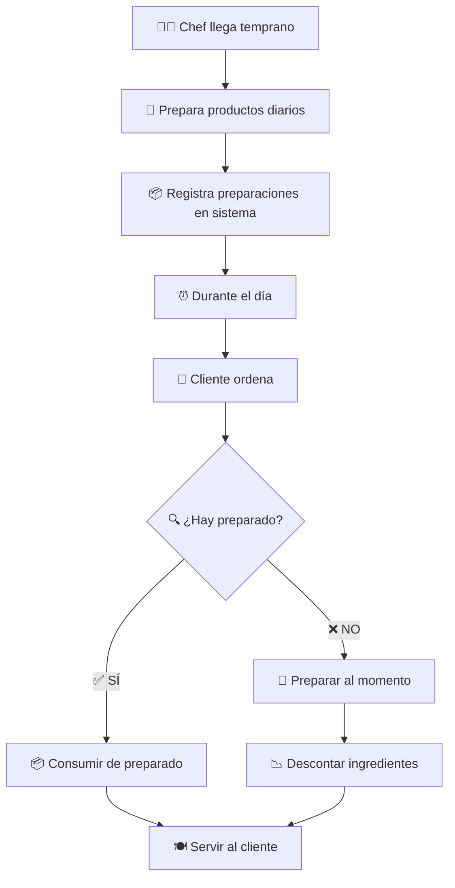

# Análisis: Contexto de Preparaciones Diarias

## 🎯 **PROBLEMA IDENTIFICADO**

### **Escenario Actual vs Realidad de Restaurante**

**❌ Flujo Actual (Problemático):**
```
Cliente ordena → Verifica stock ingredientes → Resta ingredientes → Prepara en tiempo real
```

**✅ Flujo Real de Restaurante:**
```
Chef prepara comida diariamente → Almacena preparaciones → Cliente ordena → Toma de preparado
```

### **Ejemplo Práctico:**
- **Mañana**: Chef prepara 20 pizzas margarita, 15 ensaladas césar
- **Mediodía**: Cliente ordena pizza → Sistema toma de las 20 preparadas, no de ingredientes
- **Si se agota**: Entonces sí prepara al momento con ingredientes

---

## 🏗️ **SOLUCIÓN ARQUITECTÓNICA: PREPARACIONES EN OPERACIONES** ⭐

### **📁 Ubicación Decidida:**
```
RestaurantePro.Domain/
├── Operaciones/
│   ├── Comandas/
│   ├── Reservaciones/
│   ├── Preparaciones/     ← AQUÍ (MEJOR OPCIÓN)
│   │   ├── Entities/
│   │   ├── Enums/
│   │   ├── Services/
│   │   └── Events/
│   └── Services/
```

### **🎯 Justificación de Ubicación:**
1. **🍳 Parte de operaciones diarias** del restaurante
2. **🔄 Flujo operativo natural**: Preparar → Comandar → Servir
3. **👨‍🍳 Mismos actores**: Chefs preparan y sirven
4. **📊 Cohesión alta**: Todo el proceso operativo unificado
5. **🏗️ Arquitectura simple**: Menos contextos, menos complejidad

---

## 🏗️ **ARQUITECTURA DEL MÓDULO PREPARACIONES**

### **🗂️ Estructura de Entidades:**

#### **1. 📦 PreparacionDiaria** (Agregado Principal)
```csharp
public class PreparacionDiaria : EntityBase<Guid>
{
    public Guid ProductoId { get; private set; }
    public int CantidadPreparada { get; private set; }
    public int CantidadDisponible { get; private set; }
    public DateTime FechaPreparacion { get; private set; }
    public DateTime? FechaVencimiento { get; private set; }
    public EstadoPreparacion Estado { get; private set; }
    public Guid ChefId { get; private set; }
    
    // Métodos de negocio
    public Result ConsumirCantidad(int cantidad)
    public Result AgregarCantidad(int cantidadAdicional)
    public Result MarcarComoVencida()
    public bool EstaDisponible(int cantidadRequerida)
}
```

#### **2. 📊 EstadoPreparacion** (Enum)
```csharp
public enum EstadoPreparacion
{
    Preparando = 1,
    Disponible = 2,
    PorVencer = 3,
    Vencida = 4,
    Agotada = 5
}
```

### **🔧 Servicios:**

#### **3. 🏭 ServicioPreparaciones**
```csharp
public interface IServicioPreparaciones
{
    Task<Result<PreparacionDiaria>> PrepararProductoAsync(Guid productoId, int cantidad, Guid chefId);
    Task<Result<bool>> VerificarDisponibilidadAsync(Guid productoId, int cantidadRequerida);
    Task<Result> ConsumirPreparacionAsync(Guid productoId, int cantidad);
    Task<Result<List<PreparacionDiaria>>> ObtenerPreparacionesDelDiaAsync();
    Task<Result> MarcarVencidasAsync();
}
```

---

## 🔄 **FLUJO ACTUALIZADO CON PREPARACIONES**

### **📋 FLUJO COMPLETO:**



### **🔧 Cambios en el Sistema Actual:**

#### **1. 📝 Actualizar ComandaService:**
```csharp
public async Task<Result<Comanda>> CrearComandaAsync(...)
{
    foreach (var item in itemsComanda)
    {
        // 🔄 NUEVO: Verificar preparaciones primero
        var disponible = await _servicioPreparaciones
            .VerificarDisponibilidadAsync(item.ProductoId, item.Cantidad);
        
        if (disponible.Value)
        {
            // ✅ Consumir de preparaciones
            await _servicioPreparaciones
                .ConsumirPreparacionAsync(item.ProductoId, item.Cantidad);
        }
        else
        {
            // ❌ Preparar al momento = descontar ingredientes
            await _verificadorStock
                .VerificarDisponibilidadAsync(item.ProductoId, item.Cantidad);
        }
    }
    
    // Crear comanda...
}
```

#### **2. 🎯 Event Handler para Comandas:**
```csharp
public class ComandaCreada_ActualizarPreparacionesHandler 
    : IDomainEventHandler<ComandaCreada>
{
    public async Task Handle(ComandaCreada evento)
    {
        foreach (var item in evento.Items)
        {
            // Intentar consumir de preparaciones primero
            var resultado = await _servicioPreparaciones
                .ConsumirPreparacionAsync(item.ProductoId, item.Cantidad);
            
            if (!resultado.Succeeded)
            {
                // Si no hay preparaciones, usar ingredientes
                await _inventarioService
                    .DescontarIngredientesAsync(item.ProductoId, item.Cantidad);
            }
        }
    }
}
```

---

## 📊 **BENEFICIOS DE LA SOLUCIÓN**

### **✅ Beneficios Operacionales:**
1. **🚀 Servicio más rápido**: No esperar preparación al momento
2. **📈 Mayor throughput**: Más comandas por hora
3. **😊 Mejor experiencia**: Clientes contentos con rapidez
4. **🎯 Control de desperdicios**: Preparar cantidades justas

### **✅ Beneficios Técnicos:**
1. **🏗️ Arquitectura realista**: Refleja operación real
2. **📊 Métricas precisas**: Stock vs preparaciones
3. **🔄 Flujo híbrido**: Preparado + al momento
4. **⚡ Performance**: Menos consultas a inventario

### **✅ Beneficios de Negocio:**
1. **💰 Costos optimizados**: Menos desperdicio
2. **📈 Ventas mejoradas**: Servicio más rápido
3. **📊 Reportes precisos**: Qué se prepara vs qué se vende
4. **🎯 Planificación mejor**: Datos históricos de preparaciones

---

## 🚀 **PLAN DE IMPLEMENTACIÓN**

### **📅 Fase 1: Entidades Base**
- ✅ Crear estructura en `/Operaciones/Preparaciones/`
- ✅ Implementar `PreparacionDiaria`
- ✅ Implementar `EstadoPreparacion`
- ✅ Tests unitarios básicos

### **📅 Fase 2: Servicios**
- 🔄 Implementar `IServicioPreparaciones`
- 🔄 Integrar con repositorio
- 🔄 Tests unitarios de servicios

### **📅 Fase 3: Integración**
- 🔄 Actualizar `OperacionesServiceFacade`
- 🔄 Modificar flujo de comandas
- 🔄 Event handlers
- 🔄 Tests de integración

### **📅 Fase 4: UI y Reportes**
- ⏳ Dashboard para chefs
- ⏳ Reportes de preparaciones
- ⏳ Alertas de vencimiento

---

## 🎯 **MÉTRICAS DE ÉXITO**

| Métrica | Valor Actual | Objetivo | Impacto |
|---------|--------------|----------|---------|
| **Tiempo promedio de preparación** | 15-20 min | 3-5 min | 🚀 70% mejora |
| **Comandas por hora** | 15-20 | 40-50 | 🚀 150% mejora |
| **Desperdicio de comida** | 15-20% | 5-8% | 💰 60% reducción |
| **Satisfacción del cliente** | 75% | 90%+ | 😊 20% mejora |

¡**EXCELENTE decisión arquitectónica!** 🎉 Las preparaciones van perfectas dentro de **Operaciones**. 