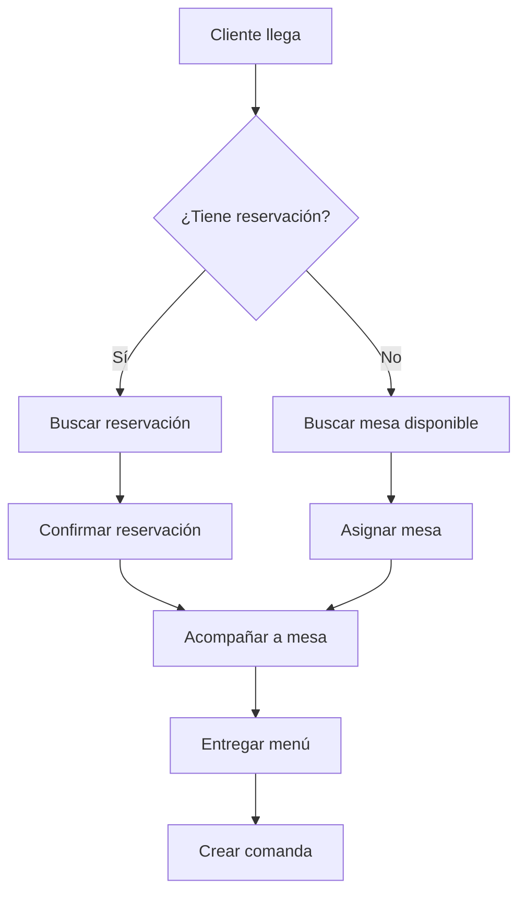

# Flujos de Negocio Específicos para Mobile - RestaurantePro

---

## 📋 **INFORMACIÓN DEL DOCUMENTO**
- **Objetivo**: Mapear flujos de negocio optimizados para la experiencia móvil
- **Enfoque**: UX/UI específica para dispositivos móviles y casos de uso del personal
- **Integración**: Con los 18 flujos completos del backend

---

## 🎯 **FLUJOS PRINCIPALES MOBILE**

### **1. FLUJO MESERO - ATENCIÓN AL CLIENTE**

#### **A. Flujo de Llegada del Cliente**


```csharp
// MeseroFlowService.cs - Flujo específico del mesero
public class MeseroFlowService : IMeseroFlowService
{
    public async Task<Result<AtenderClienteResult>> EjecutarFlujoAtenderClienteAsync(AtenderClienteRequest request)
    {
        var result = new AtenderClienteResult();
        
        try
        {
            // Paso 1: Verificar si tiene reservación
            if (!string.IsNullOrEmpty(request.NumeroReservacion))
            {
                result.Reservacion = await _reservacionService.ConfirmarReservacionAsync(request.NumeroReservacion);
                if (result.Reservacion.Succeeded)
                {
                    result.Mesa = await _mesaService.AsignarMesaReservadaAsync(result.Reservacion.Data.MesaId);
                }
            }
            else
            {
                // Buscar mesa disponible
                var mesasDisponibles = await _mesaService.GetMesasDisponiblesAsync();
                if (mesasDisponibles.Succeeded && mesasDisponibles.Data.Any())
                {
                    // Mostrar selector de mesa en UI
                    result.MesasDisponibles = mesasDisponibles.Data;
                    result.RequiereSeleccionMesa = true;
                }
                else
                {
                    result.RequiereEspera = true;
                    result.TiempoEsperaEstimado = await _mesaService.CalcularTiempoEsperaAsync();
                }
            }

            // Paso 2: Crear comanda inicial
            if (result.Mesa?.Succeeded == true)
            {
                result.Comanda = await _comandaService.CrearComandaAsync(new CrearComandaRequest
                {
                    MesaId = result.Mesa.Data.Id,
                    MeseroId = request.MeseroId,
                    NumeroPersonas = request.NumeroPersonas
                });
            }

            result.IsSuccess = true;
            return Result<AtenderClienteResult>.Success(result);
        }
        catch (Exception ex)
        {
            return Result<AtenderClienteResult>.Failure($"Error en flujo de atención: {ex.Message}");
        }
    }
}
```

#### **B. Flujo de Tomar Orden**
```csharp
// TomarOrdenFlowService.cs
public class TomarOrdenFlowService : ITomarOrdenFlowService
{
    public async Task<Result<TomarOrdenResult>> EjecutarFlujoTomarOrdenAsync(TomarOrdenRequest request)
    {
        var result = new TomarOrdenResult();
        
        try
        {
            // Paso 1: Cargar menú con precios actualizados
            result.Menu = await _productoService.GetMenuActivoAsync();
            
            // Paso 2: Aplicar promociones disponibles
            result.PromocionesDisponibles = await _promocionService.GetPromocionesActivasAsync();
            
            // Paso 3: Verificar disponibilidad de ingredientes
            foreach (var item in request.ProductosSeleccionados)
            {
                var disponibilidad = await _inventarioService.VerificarDisponibilidadAsync(item.ProductoId);
                if (!disponibilidad.Succeeded)
                {
                    result.ProductosNoDisponibles.Add(item.ProductoId);
                }
            }
            
            // Paso 4: Calcular totales con promociones
            result.ResumenOrden = await _calculadoraService.CalcularTotalesAsync(
                request.ProductosSeleccionados, 
                result.PromocionesDisponibles);
            
            // Paso 5: Confirmar orden si todo está disponible
            if (!result.ProductosNoDisponibles.Any())
            {
                result.ComandaActualizada = await _comandaService.ActualizarComandaAsync(request.ComandaId, new ActualizarComandaRequest
                {
                    ProductosSeleccionados = request.ProductosSeleccionados,
                    PromocionesAplicadas = result.PromocionesDisponibles.Where(p => p.EsAplicable).ToList()
                });
                
                // Notificar a cocina
                await _notificationService.NotificarNuevaOrdenAsync(request.ComandaId);
            }

            result.IsSuccess = !result.ProductosNoDisponibles.Any();
            return Result<TomarOrdenResult>.Success(result);
        }
        catch (Exception ex)
        {
            return Result<TomarOrdenResult>.Failure($"Error tomando orden: {ex.Message}");
        }
    }
}
```

---

### **2. FLUJO COCINERO - PREPARACIÓN**

#### **A. Flujo de Recibir Órdenes**
```csharp
// CocineroFlowService.cs
public class CocineroFlowService : ICocineroFlowService
{
    public async Task<Result<RecibirOrdenesResult>> EjecutarFlujoRecibirOrdenesAsync()
    {
        var result = new RecibirOrdenesResult();
        
        try
        {
            // Obtener órdenes pendientes ordenadas por prioridad
            result.OrdenesPendientes = await _preparacionService.GetOrdenesPendientesAsync();
            
            // Calcular tiempos de preparación estimados
            foreach (var orden in result.OrdenesPendientes.Data)
            {
                orden.TiempoEstimado = await _calculadoraService.CalcularTiempoPreparacionAsync(orden.Productos);
                orden.Prioridad = await _calculadoraService.CalcularPrioridadAsync(orden);
            }
            
            // Verificar disponibilidad de ingredientes
            result.AlertasInventario = await _inventarioService.GetAlertasStockBajoAsync();
            
            // Optimizar orden de preparación
            result.OrdenOptimizado = await _optimizadorService.OptimizarOrdenPreparacionAsync(result.OrdenesPendientes.Data);
            
            result.IsSuccess = true;
            return Result<RecibirOrdenesResult>.Success(result);
        }
        catch (Exception ex)
        {
            return Result<RecibirOrdenesResult>.Failure($"Error recibiendo órdenes: {ex.Message}");
        }
    }

    public async Task<Result<IniciarPreparacionResult>> EjecutarFlujoIniciarPreparacionAsync(IniciarPreparacionRequest request)
    {
        var result = new IniciarPreparacionResult();
        
        try
        {
            // Cambiar estado de la preparación
            result.Preparacion = await _preparacionService.IniciarPreparacionAsync(request.PreparacionId);
            
            // Reservar ingredientes
            await _inventarioService.ReservarIngredientesAsync(request.PreparacionId);
            
            // Notificar actualización de estado
            await _signalRService.NotificarCambioEstadoPreparacionAsync(request.PreparacionId, EstadoPreparacion.EnPreparacion);
            
            // Iniciar timer de preparación
            result.TimerIniciado = await _timerService.IniciarTimerAsync(request.PreparacionId, result.Preparacion.Data.TiempoEstimado);
            
            result.IsSuccess = true;
            return Result<IniciarPreparacionResult>.Success(result);
        }
        catch (Exception ex)
        {
            return Result<IniciarPreparacionResult>.Failure($"Error iniciando preparación: {ex.Message}");
        }
    }
}
```

---

### **3. FLUJO CAJERO - FACTURACIÓN**

#### **A. Flujo de Cierre de Cuenta**
```csharp
// CajeroFlowService.cs
public class CajeroFlowService : ICajeroFlowService
{
    public async Task<Result<CerrarCuentaResult>> EjecutarFlujoCerrarCuentaAsync(CerrarCuentaRequest request)
    {
        var result = new CerrarCuentaResult();
        
        try
        {
            // Paso 1: Obtener comanda completa
            result.Comanda = await _comandaService.GetComandaByIdAsync(request.ComandaId, incluirItems: true);
            
            // Paso 2: Verificar que todos los items estén servidos
            var itemsPendientes = result.Comanda.Data.Items.Where(i => i.Estado != EstadoItemComanda.Servido).ToList();
            if (itemsPendientes.Any())
            {
                result.RequiereConfirmacion = true;
                result.ItemsPendientes = itemsPendientes;
            }
            
            // Paso 3: Aplicar descuentos de última hora si aplica
            result.DescuentosDisponibles = await _promocionService.GetDescuentosFinalesAsync(result.Comanda.Data);
            
            // Paso 4: Calcular total final
            result.TotalFinal = await _calculadoraService.CalcularTotalFinalAsync(
                result.Comanda.Data, 
                result.DescuentosDisponibles);
            
            // Paso 5: Verificar programa de fidelización
            if (result.Comanda.Data.ClienteId.HasValue)
            {
                result.PuntosFidelizacion = await _fidelizacionService.CalcularPuntosAsync(
                    result.Comanda.Data.ClienteId.Value, 
                    result.TotalFinal.MontoTotal);
            }
            
            result.IsSuccess = true;
            return Result<CerrarCuentaResult>.Success(result);
        }
        catch (Exception ex)
        {
            return Result<CerrarCuentaResult>.Failure($"Error cerrando cuenta: {ex.Message}");
        }
    }

    public async Task<Result<ProcesarPagoResult>> EjecutarFlujoProcesarPagoAsync(ProcesarPagoRequest request)
    {
        var result = new ProcesarPagoResult();
        
        try
        {
            // Paso 1: Validar método de pago
            var validacionPago = await _pagoService.ValidarMetodoPagoAsync(request.MetodoPago);
            if (!validacionPago.Succeeded)
            {
                return Result<ProcesarPagoResult>.Failure(validacionPago.Error);
            }
            
            // Paso 2: Procesar pago
            result.TransaccionPago = await _pagoService.ProcesarPagoAsync(request);
            
            // Paso 3: Generar factura
            if (result.TransaccionPago.Succeeded)
            {
                result.Factura = await _facturaService.GenerarFacturaAsync(new GenerarFacturaRequest
                {
                    ComandaId = request.ComandaId,
                    TransaccionPagoId = result.TransaccionPago.Data.Id,
                    MetodoPago = request.MetodoPago,
                    MontoTotal = request.MontoTotal
                });
                
                // Paso 4: Aplicar puntos de fidelización
                if (request.ClienteId.HasValue)
                {
                    await _fidelizacionService.AplicarPuntosAsync(request.ClienteId.Value, request.MontoTotal);
                }
                
                // Paso 5: Liberar mesa
                await _mesaService.LiberarMesaAsync(request.MesaId);
                
                // Paso 6: Enviar factura por email si se solicita
                if (!string.IsNullOrEmpty(request.EmailFactura))
                {
                    await _facturaService.EnviarFacturaPorEmailAsync(result.Factura.Data.Id, request.EmailFactura);
                }
            }
            
            result.IsSuccess = result.TransaccionPago.Succeeded && result.Factura.Succeeded;
            return Result<ProcesarPagoResult>.Success(result);
        }
        catch (Exception ex)
        {
            return Result<ProcesarPagoResult>.Failure($"Error procesando pago: {ex.Message}");
        }
    }
}
```

---

### **4. FLUJOS OFFLINE Y SINCRONIZACIÓN**

#### **A. Flujo Offline Inteligente**
```csharp
// OfflineFlowService.cs
public class OfflineFlowService : IOfflineFlowService
{
    public async Task<Result<OfflineOperationResult>> EjecutarOperacionOfflineAsync<T>(
        OfflineOperationRequest<T> request) where T : class
    {
        var result = new OfflineOperationResult();
        
        try
        {
            // Paso 1: Validar operación offline
            var validacion = await ValidarOperacionOfflineAsync(request);
            if (!validacion.IsValid)
            {
                return Result<OfflineOperationResult>.Failure(validacion.ErrorMessage);
            }
            
            // Paso 2: Guardar operación localmente
            var operacionLocal = new OfflineOperation
            {
                Id = Guid.NewGuid(),
                Type = request.OperationType,
                Data = JsonSerializer.Serialize(request.Data),
                CreatedAt = DateTime.UtcNow,
                Status = OfflineOperationStatus.Pending,
                Priority = CalcularPrioridad(request.OperationType)
            };
            
            await _offlineRepository.InsertAsync(operacionLocal);
            
            // Paso 3: Ejecutar lógica local si es posible
            switch (request.OperationType)
            {
                case OfflineOperationType.CrearComanda:
                    result.LocalResult = await EjecutarCrearComandaOfflineAsync(request.Data);
                    break;
                case OfflineOperationType.ActualizarComanda:
                    result.LocalResult = await EjecutarActualizarComandaOfflineAsync(request.Data);
                    break;
                case OfflineOperationType.CambiarEstadoMesa:
                    result.LocalResult = await EjecutarCambiarEstadoMesaOfflineAsync(request.Data);
                    break;
            }
            
            // Paso 4: Programar sincronización automática
            await _syncScheduler.ScheduleSyncAsync(operacionLocal.Id);
            
            result.IsSuccess = true;
            result.OperationId = operacionLocal.Id;
            result.Message = "Operación guardada para sincronización posterior";
            
            return Result<OfflineOperationResult>.Success(result);
        }
        catch (Exception ex)
        {
            return Result<OfflineOperationResult>.Failure($"Error en operación offline: {ex.Message}");
        }
    }

    public async Task<Result<SyncResult>> EjecutarSincronizacionInteligenteAsync()
    {
        var result = new SyncResult();
        
        try
        {
            // Verificar conectividad
            if (!await _connectivityService.IsConnectedAsync())
            {
                return Result<SyncResult>.Failure("Sin conexión disponible");
            }
            
            // Obtener operaciones pendientes ordenadas por prioridad
            var operacionesPendientes = await _offlineRepository.GetOperacionesPendientesAsync();
            
            result.TotalOperaciones = operacionesPendientes.Count;
            result.OperacionesExitosas = 0;
            result.OperacionesFallidas = 0;
            
            // Procesar operaciones en lotes
            var lotes = operacionesPendientes.ChunkBy(10); // Lotes de 10
            
            foreach (var lote in lotes)
            {
                var tareas = lote.Select(async operacion =>
                {
                    try
                    {
                        var resultadoSync = await SincronizarOperacionAsync(operacion);
                        if (resultadoSync.Succeeded)
                        {
                            await _offlineRepository.MarcarComoSincronizadaAsync(operacion.Id);
                            result.OperacionesExitosas++;
                        }
                        else
                        {
                            await _offlineRepository.MarcarComoFallidaAsync(operacion.Id, resultadoSync.Error);
                            result.OperacionesFallidas++;
                        }
                    }
                    catch (Exception ex)
                    {
                        await _offlineRepository.MarcarComoFallidaAsync(operacion.Id, ex.Message);
                        result.OperacionesFallidas++;
                    }
                });
                
                await Task.WhenAll(tareas);
            }
            
            result.IsSuccess = result.OperacionesFallidas == 0;
            result.Message = $"Sincronización completada: {result.OperacionesExitosas} exitosas, {result.OperacionesFallidas} fallidas";
            
            return Result<SyncResult>.Success(result);
        }
        catch (Exception ex)
        {
            return Result<SyncResult>.Failure($"Error en sincronización: {ex.Message}");
        }
    }
}
```

---

### **5. FLUJOS DE NOTIFICACIONES EN TIEMPO REAL**

#### **A. Flujo de Notificaciones Push**
```csharp
// NotificationFlowService.cs
public class NotificationFlowService : INotificationFlowService
{
    public async Task<Result<NotificationResult>> EjecutarFlujoNotificacionesAsync()
    {
        var result = new NotificationResult();
        
        try
        {
            // Configurar listeners de SignalR
            await ConfigurarListenersSignalRAsync();
            
            // Configurar notificaciones push
            await ConfigurarNotificacionesPushAsync();
            
            // Configurar notificaciones locales
            await ConfigurarNotificacionesLocalesAsync();
            
            result.IsSuccess = true;
            return Result<NotificationResult>.Success(result);
        }
        catch (Exception ex)
        {
            return Result<NotificationResult>.Failure($"Error configurando notificaciones: {ex.Message}");
        }
    }

    private async Task ConfigurarListenersSignalRAsync()
    {
        // Comandas
        _signalRService.ComandaUpdated += async (sender, args) =>
        {
            await _localNotificationService.ShowAsync(
                "Comanda Actualizada",
                $"Comanda {args.Comanda.Numero} - {args.Comanda.Estado}",
                NotificationType.ComandaUpdate);
        };
        
        // Preparaciones
        _signalRService.PreparacionCompleted += async (sender, args) =>
        {
            await _localNotificationService.ShowAsync(
                "Plato Listo",
                $"Mesa {args.Mesa.Numero} - {args.Producto.Nombre}",
                NotificationType.PreparacionCompleta);
        };
        
        // Alertas de inventario
        _signalRService.InventoryAlert += async (sender, args) =>
        {
            await _localNotificationService.ShowAsync(
                "Alerta de Inventario",
                $"Stock bajo: {args.Ingrediente.Nombre}",
                NotificationType.InventoryAlert);
        };
    }
}
```

---

### **6. FLUJOS DE OPTIMIZACIÓN UX**

#### **A. Flujo de Gestos y Atajos**
```csharp
// GestureFlowService.cs
public class GestureFlowService : IGestureFlowService
{
    public void ConfigurarGestosOptimizados()
    {
        // Swipe para cambiar estados rápidamente
        ConfigurarSwipeGestures();
        
        // Long press para acciones rápidas
        ConfigurarLongPressGestures();
        
        // Doble tap para favoritos
        ConfigurarDoubleTapGestures();
    }

    private void ConfigurarSwipeGestures()
    {
        // Swipe derecho en comanda = Marcar como lista
        // Swipe izquierdo en comanda = Cancelar
        // Swipe arriba en mesa = Ver detalles
        // Swipe abajo en producto = Agregar rápido
    }
}
```

#### **B. Flujo de Acciones Rápidas**
```csharp
// QuickActionFlowService.cs
public class QuickActionFlowService : IQuickActionFlowService
{
    public async Task<Result<QuickActionResult>> EjecutarAccionRapidaAsync(QuickActionRequest request)
    {
        var result = new QuickActionResult();
        
        try
        {
            switch (request.ActionType)
            {
                case QuickActionType.AgregarProductoFavorito:
                    result = await AgregarProductoFavoritoAsync(request.TargetId, request.ContextId);
                    break;
                    
                case QuickActionType.CambiarEstadoMesaRapido:
                    result = await CambiarEstadoMesaRapidoAsync(request.TargetId, request.NewStatus);
                    break;
                    
                case QuickActionType.NotificarCocinaUrgente:
                    result = await NotificarCocinaUrgenteAsync(request.TargetId);
                    break;
                    
                case QuickActionType.DuplicarUltimaComanda:
                    result = await DuplicarUltimaComandaAsync(request.ContextId);
                    break;
            }
            
            // Haptic feedback
            await _hapticService.TriggerSuccessAsync();
            
            return Result<QuickActionResult>.Success(result);
        }
        catch (Exception ex)
        {
            await _hapticService.TriggerErrorAsync();
            return Result<QuickActionResult>.Failure($"Error en acción rápida: {ex.Message}");
        }
    }
}
```

---

### **7. FLUJOS DE ANALÍTICA Y REPORTES MOBILE**

#### **A. Flujo de Dashboard en Tiempo Real**
```csharp
// MobileDashboardFlowService.cs
public class MobileDashboardFlowService : IMobileDashboardFlowService
{
    public async Task<Result<MobileDashboardResult>> EjecutarFlujoDashboardAsync(DashboardRequest request)
    {
        var result = new MobileDashboardResult();
        
        try
        {
            // Datos optimizados para móvil (menos detalle, más visuales)
            var tasks = new[]
            {
                ObtenerMetricasRapidas(),
                ObtenerEstadoMesas(),
                ObtenerComandasActivas(),
                ObtenerAlertasImportantes(),
                ObtenerVentasDelDia()
            };
            
            await Task.WhenAll(tasks);
            
            result.MetricasRapidas = tasks[0].Result;
            result.EstadoMesas = tasks[1].Result;
            result.ComandasActivas = tasks[2].Result;
            result.AlertasImportantes = tasks[3].Result;
            result.VentasDelDia = tasks[4].Result;
            
            // Configurar actualización automática cada 30 segundos
            ConfigurarActualizacionAutomatica(TimeSpan.FromSeconds(30));
            
            result.IsSuccess = true;
            return Result<MobileDashboardResult>.Success(result);
        }
        catch (Exception ex)
        {
            return Result<MobileDashboardResult>.Failure($"Error cargando dashboard: {ex.Message}");
        }
    }
}
```

---

## 🎯 **MATRIZ DE FLUJOS POR ROL**

| Flujo | Mesero | Cocinero | Cajero | Gerente | Admin |
|-------|--------|----------|---------|---------|-------|
| Atender Cliente | ✅ | ❌ | ❌ | 👁️ | 👁️ |
| Tomar Orden | ✅ | ❌ | ❌ | 👁️ | 👁️ |
| Preparar Comida | ❌ | ✅ | ❌ | 👁️ | 👁️ |
| Procesar Pago | ❌ | ❌ | ✅ | 👁️ | 👁️ |
| Ver Reportes | ❌ | ❌ | ❌ | ✅ | ✅ |
| Configurar Sistema | ❌ | ❌ | ❌ | ❌ | ✅ |
| Gestionar Inventario | ❌ | 👁️ | ❌ | ✅ | ✅ |
| Gestionar Personal | ❌ | ❌ | ❌ | ✅ | ✅ |

**Leyenda:**
- ✅ = Acceso completo
- 👁️ = Solo lectura
- ❌ = Sin acceso

---

## 📱 **OPTIMIZACIONES UX ESPECÍFICAS MOBILE**

### **1. Navegación Optimizada**
- **Navegación por tabs** para acceso rápido
- **Swipe gestures** para acciones comunes
- **Floating action buttons** para acciones principales
- **Pull to refresh** en todas las listas
- **Infinite scroll** para cargas progresivas

### **2. Entrada de Datos Optimizada**
- **Teclados específicos** por tipo de campo
- **Autocompletado** inteligente
- **Códigos QR** para identificación rápida
- **Reconocimiento de voz** para observaciones
- **Cámara** para fotos de platos

### **3. Feedback Visual y Háptico**
- **Animaciones fluidas** para transiciones
- **Loading states** claros
- **Haptic feedback** para confirmaciones
- **Notificaciones toast** no intrusivas
- **Progress indicators** para operaciones largas

---

## 🔄 **SINCRONIZACIÓN INTELIGENTE**

### **Estrategias por Tipo de Conexión**
- **WiFi rápido**: Sincronización completa en tiempo real
- **WiFi lento**: Sincronización por lotes cada 2 minutos
- **4G/5G**: Sincronización selectiva de datos críticos
- **3G**: Solo operaciones críticas
- **Sin conexión**: Modo offline completo

### **Prioridades de Sincronización**
1. **Crítico**: Comandas, cambios de estado de mesa
2. **Alto**: Facturas, pagos
3. **Medio**: Actualizaciones de inventario
4. **Bajo**: Reportes, analítica

---

*Estos flujos específicos para mobile aseguran una experiencia optimizada para cada rol del personal del restaurante, aprovechando al máximo las capacidades de los dispositivos móviles y manteniendo la eficiencia operativa.* 