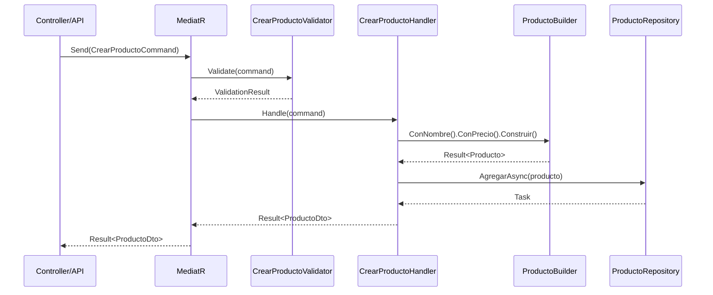

# Vertical Slices - Contexto Core/Productos

Este directorio contiene los casos de uso para el módulo de **Productos**, organizados siguiendo el patrón de **Vertical Slices**.

## 🏗️ **Estructura de Vertical Slices**

Cada caso de uso (slice) está organizado en su propia carpeta:

```
Productos/
├── Commands/                    # Operaciones que modifican datos
│   ├── CrearProducto/          ✅ IMPLEMENTADO
│   │   ├── CrearProductoCommand.cs      # Comando + DTO
│   │   ├── CrearProductoValidator.cs    # Validador FluentValidation
│   │   └── CrearProductoHandler.cs      # Lógica de negocio
│   │
│   ├── ActualizarProducto/     🔄 PENDIENTE
│   │   ├── ActualizarProductoCommand.cs
│   │   ├── ActualizarProductoValidator.cs
│   │   └── ActualizarProductoHandler.cs
│   │
│   └── EliminarProducto/       🔄 PENDIENTE
│       ├── EliminarProductoCommand.cs
│       ├── EliminarProductoValidator.cs
│       └── EliminarProductoHandler.cs
│
└── Queries/                     # Operaciones de solo lectura
    ├── ObtenerProductoPorId/    ✅ IMPLEMENTADO
    │   ├── ObtenerProductoPorIdQuery.cs     # Query + DTO
    │   └── ObtenerProductoPorIdHandler.cs   # Lógica de consulta
    │
    ├── ObtenerProductosPaginados/ 🔄 PENDIENTE
    │   ├── ObtenerProductosPaginadosQuery.cs
    │   └── ObtenerProductosPaginadosHandler.cs
    │
    └── BuscarProductosPorCategoria/ 🔄 PENDIENTE
        ├── BuscarProductosPorCategoriaQuery.cs
        └── BuscarProductosPorCategoriaHandler.cs
```

## 🎯 **Patrones Implementados**

### **1. CQRS (Command Query Responsibility Segregation)**
- **Commands**: Para operaciones que modifican datos (`CrearProducto`, `ActualizarProducto`)
- **Queries**: Para operaciones que solo leen datos (`ObtenerProductoPorId`, `BuscarProductos`)

### **2. Mediator Pattern con MediatR**
- Desacopla el envío de comandos/queries de su ejecución
- Permite agregar comportamientos transversales (logging, validación, caché)

### **3. Validation Pipeline con FluentValidation**
- Cada comando tiene su propio validador específico
- Las validaciones se ejecutan automáticamente antes del handler

### **4. Result Pattern**
- Retorno estandarizado para operaciones
- Manejo uniforme de errores y excepciones

## 🔄 **Flujo de Ejecución - CrearProducto**



## 🎨 **Ejemplo de Uso**

### **Crear un Producto**
```csharp
// Desde un controlador o API endpoint
var command = new CrearProductoCommand
{
    Nombre = "Pizza Margherita",
    Descripcion = "Clásica pizza italiana con tomate, mozzarella y albahaca",
    Precio = 15.99m,
    Categoria = ProductoCategoria.PlatoPrincipal
};

var resultado = await mediator.Send(command);

if (resultado.Succeeded)
{
    var producto = resultado.Value; // ProductoDto
    // Producto creado exitosamente
}
else
{
    var error = resultado.ErrorMessage;
    // Manejar error
}
```

### **Obtener un Producto por ID**
```csharp
var query = new ObtenerProductoPorIdQuery(productoId);
var resultado = await mediator.Send(query);

if (resultado.Succeeded)
{
    var producto = resultado.Value; // ProductoDto
}
```

## ✅ **Beneficios de esta Estructura**

1. **🎯 Alta cohesión**: Todo el código para una funcionalidad está junto
2. **🔗 Bajo acoplamiento**: Cada slice es independiente de los demás  
3. **🔧 Fácil de mantener**: Los cambios están localizados
4. **👥 Desarrollo en paralelo**: Diferentes desarrolladores pueden trabajar en diferentes slices
5. **🧪 Testing simplificado**: Cada slice puede probarse de forma aislada

## 🚀 **Integración con Domain**

### **Uso de Builders del Domain**
```csharp
// En CrearProductoHandler
var resultado = _builder
    .ConNombre(request.Nombre)
    .ConDescripcion(request.Descripcion)
    .ConPrecio(request.Precio)
    .EnCategoria(request.Categoria)
    .Construir();
```

### **Uso de Value Objects**
```csharp
// El handler recibe primitivos pero el domain usa Value Objects
public class ProductoDto
{
    public string Nombre { get; set; }  // ← Primitivo en Application
    // Se mapea a Producto.Nombre (ProductoNombre value object) en Domain
}
```

## 📋 **Próximos Pasos - Roadmap**

### **🔥 Prioridad Alta**
1. ✅ **CrearProducto** - Implementado
2. ✅ **ObtenerProductoPorId** - Implementado  
3. 🔄 **ActualizarProducto** - Por implementar
4. 🔄 **ObtenerProductosPaginados** - Por implementar

### **🟡 Prioridad Media**
5. 🔄 **EliminarProducto** - Por implementar
6. 🔄 **BuscarProductosPorCategoria** - Por implementar
7. 🔄 **ActivarDesactivarProducto** - Por implementar

### **🟢 Prioridad Baja**
8. 🔄 **ImportarProductosDesdeExcel** - Por implementar
9. 🔄 **ExportarProductosAPDF** - Por implementar

## 🧪 **Testing Strategy**

Cada Vertical Slice debe tener:

1. **Unit Tests** para el Handler
2. **Unit Tests** para el Validator
3. **Integration Tests** end-to-end

```csharp
// Ejemplo de test para CrearProductoHandler
[Test]
public async Task Handle_ValidCommand_ReturnsSuccessResult()
{
    // Arrange
    var command = new CrearProductoCommand { 
        Nombre = "Test Producto", 
        Precio = 10.99m 
    };

    // Act
    var result = await _handler.Handle(command, CancellationToken.None);

    // Assert
    Assert.That(result.Succeeded, Is.True);
    Assert.That(result.Value.Nombre, Is.EqualTo("Test Producto"));
}
```

---

**¡Esta estructura nos permite escalar fácilmente agregando nuevos Vertical Slices sin afectar los existentes!** 🚀 