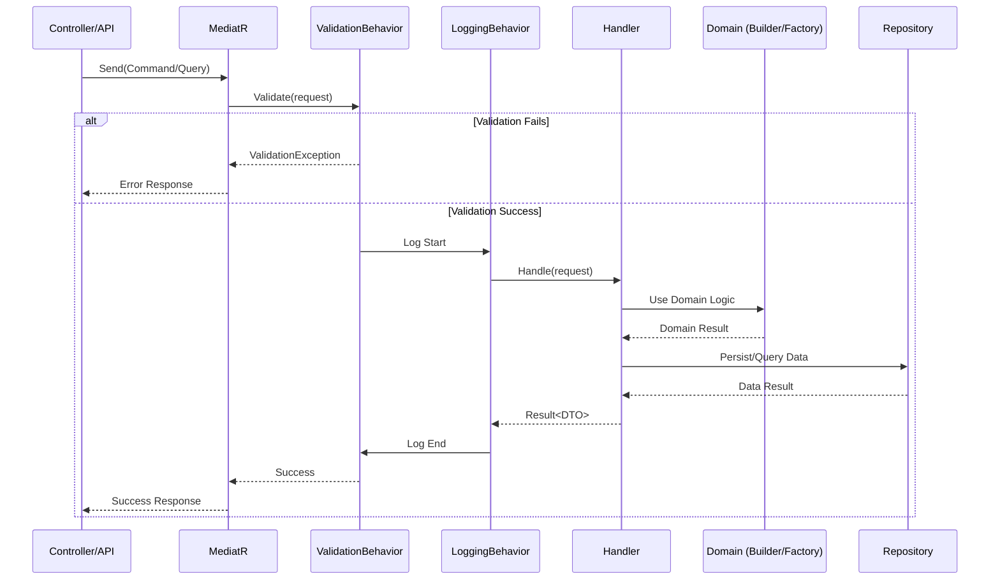

# Capa de Aplicación - RestaurantePro

Esta capa implementa la **lógica de aplicación** siguiendo el patrón **Vertical Slices Architecture** para organizar casos de uso de manera cohesiva y escalable.

## 🏗️ **Arquitectura: Vertical Slices + Componentes Compartidos**

En lugar de organizar horizontalmente por tipos (Controllers, Services, DTOs), organizamos **verticalmente por features/casos de uso**, complementado con **componentes compartidos** para cross-cutting concerns:

```
Application/
├── Core/                     # Contexto Core - Componentes base
│   ├── Productos/            # 🔥 Gestión del catálogo de productos
│   │   ├── DTOs/             # ✨ DTOs especializados por uso
│   │   │   ├── ProductoDto.cs              ✅ DTO principal completo
│   │   │   ├── ProductoCreateDto.cs        ✅ DTO para crear (input)
│   │   │   ├── ProductoUpdateDto.cs        ✅ DTO para actualizar (input)
│   │   │   └── ProductoSummaryDto.cs       ✅ DTO resumido para listas
│   │   ├── Commands/         # Operaciones que modifican datos
│   │   │   ├── CrearProducto/          ✅ IMPLEMENTADO
│   │   │   │   ├── CrearProductoCommand.cs
│   │   │   │   ├── CrearProductoValidator.cs  
│   │   │   │   └── CrearProductoHandler.cs
│   │   │   ├── ActualizarProducto/     ✅ IMPLEMENTADO
│   │   │   │   ├── ActualizarProductoCommand.cs
│   │   │   │   ├── ActualizarProductoValidator.cs
│   │   │   │   └── ActualizarProductoHandler.cs
│   │   │   └── EliminarProducto/       ✅ IMPLEMENTADO
│   │   │       ├── EliminarProductoCommand.cs
│   │   │       ├── EliminarProductoValidator.cs
│   │   │       └── EliminarProductoHandler.cs
│   │   └── Queries/          # Operaciones de solo lectura
│   │       ├── ObtenerProductoPorId/   ✅ IMPLEMENTADO
│   │       │   ├── ObtenerProductoPorIdQuery.cs
│   │       │   └── ObtenerProductoPorIdHandler.cs
│   │       ├── ObtenerProductosPaginados/ ✅ IMPLEMENTADO
│   │       │   ├── ObtenerProductosPaginadosQuery.cs
│   │       │   ├── ObtenerProductosPaginadosValidator.cs
│   │       │   └── ObtenerProductosPaginadosHandler.cs
│   │       └── ObtenerProductosPorCategoria/ ✅ IMPLEMENTADO
│   │           ├── ObtenerProductosPorCategoriaQuery.cs
│   │           ├── ObtenerProductosPorCategoriaValidator.cs
│   │           └── ObtenerProductosPorCategoriaHandler.cs
│   │
│   ├── Usuarios/             # Gestión de usuarios del sistema
│   │   ├── Commands/         
│   │   │   ├── CrearUsuario/
│   │   │   ├── ActualizarUsuario/
│   │   │   └── CambiarPasswordUsuario/
│   │   └── Queries/
│   │       ├── ObtenerUsuarioPorId/
│   │       ├── ObtenerUsuariosPaginados/
│   │       └── ValidarCredencialesUsuario/
│   │
│   ├── Notificaciones/       # Sistema central de notificaciones
│   │   ├── Commands/
│   │   │   ├── EnviarNotificacion/
│   │   │   ├── MarcarComoLeida/
│   │   │   └── EliminarNotificacion/
│   │   └── Queries/
│   │       ├── ObtenerNotificacionesPorUsuario/
│   │       └── ObtenerNotificacionesNoLeidas/
│   │
│   └── Recetas/              # Gestión de recetas e ingredientes
│       ├── Commands/
│       │   ├── CrearReceta/
│       │   ├── ActualizarReceta/
│       │   └── AgregarIngredienteReceta/
│       └── Queries/
│           ├── ObtenerRecetaPorId/
│           ├── ObtenerRecetasPorProducto/
│           └── CalcularCostoReceta/
│
├── Comercial/                # Contexto Comercial - Clientes y ventas
│   ├── Clientes/             # Gestión de clientes
│   │   ├── Commands/
│   │   │   ├── CrearCliente/
│   │   │   ├── ActualizarCliente/
│   │   │   └── DesactivarCliente/
│   │   └── Queries/
│   │       ├── ObtenerClientePorId/
│   │       ├── BuscarClientesPorEmail/
│   │       └── ObtenerClientesFrecuentes/
│   │
│   ├── Fidelizacion/         # Programa de fidelización
│   │   ├── Commands/
│   │   │   ├── AcumularPuntos/
│   │   │   ├── CanjearPuntos/
│   │   │   └── CrearTarjetaFidelizacion/
│   │   └── Queries/
│   │       ├── ConsultarPuntosCliente/
│   │       └── ObtenerHistorialPuntos/
│   │
│   └── Facturacion/          # Sistema de facturación
│       ├── Commands/
│       │   ├── CrearFactura/
│       │   ├── AplicarDescuento/
│       │   └── AnularFactura/
│       └── Queries/
│           ├── ObtenerFacturaPorId/
│           ├── ObtenerFacturasPorCliente/
│           └── GenerarReporteVentas/
│
├── Operaciones/              # Contexto Operaciones - Restaurante diario
│   ├── Comandas/             # Gestión de comandas y pedidos
│   │   ├── Commands/
│   │   │   ├── CrearComanda/
│   │   │   ├── AgregarItemComanda/
│   │   │   ├── ActualizarEstadoComanda/
│   │   │   └── FinalizarComanda/
│   │   └── Queries/
│   │       ├── ObtenerComandaPorId/
│   │       ├── ObtenerComandasActivas/
│   │       └── ObtenerHistorialComandas/
│   │
│   ├── Reservaciones/        # Sistema de reservaciones
│   │   ├── Commands/
│   │   │   ├── CrearReservacion/
│   │   │   ├── ConfirmarReservacion/
│   │   │   └── CancelarReservacion/
│   │   └── Queries/
│   │       ├── ObtenerReservacionPorId/
│   │       ├── ConsultarDisponibilidad/
│   │       └── ObtenerReservacionesDia/
│   │
│   ├── Mesas/                # Gestión de mesas
│   │   ├── Commands/
│   │   │   ├── AsignarMesa/
│   │   │   ├── LiberarMesa/
│   │   │   └── CambiarEstadoMesa/
│   │   └── Queries/
│   │       ├── ObtenerMesasDisponibles/
│   │       ├── ObtenerEstadoMesas/
│   │       └── ObtenerMesaPorNumero/
│   │
│   └── Preparaciones/        # 🆕 Preparaciones diarias
│       ├── Commands/
│       │   ├── CrearPreparacionDiaria/
│       │   ├── ActualizarCantidadPreparada/
│       │   └── MarcarPreparacionCompleta/
│       └── Queries/
│           ├── ObtenerPreparacionesDia/
│           ├── ObtenerPreparacionesPendientes/
│           └── GenerarPlanPreparaciones/
│
├── Inventario/               # Contexto Inventario - Gestión de stock
│   ├── Ingredientes/         
│   │   ├── Commands/
│   │   │   ├── CrearIngrediente/
│   │   │   ├── ActualizarStock/
│   │   │   └── AjustarInventario/
│   │   └── Queries/
│   │       ├── ObtenerIngredientePorId/
│   │       ├── ObtenerIngredientesBajoStock/
│   │       └── CalcularValorInventario/
│   │
│   ├── MovimientosInventario/
│   │   ├── Commands/
│   │   │   ├── RegistrarEntrada/
│   │   │   ├── RegistrarSalida/
│   │   │   └── RegistrarAjuste/
│   │   └── Queries/
│   │       ├── ObtenerHistorialMovimientos/
│   │       └── GenerarReporteMovimientos/
│   │
│   └── OrdenesCompra/        
│       ├── Commands/
│       │   ├── CrearOrdenCompra/
│       │   ├── AprobarOrdenCompra/
│       │   └── RecebirOrdenCompra/
│       └── Queries/
│           ├── ObtenerOrdenCompraPorId/
│           ├── ObtenerOrdenesPendientes/
│           └── GenerarOrdenAutomatica/
│
├── Proveedores/              # Contexto Proveedores - Gestión de proveedores
│   ├── Proveedores/          # Gestión de proveedores
│   │   ├── Commands/
│   │   │   ├── CrearProveedor/
│   │   │   ├── ActualizarProveedor/
│   │   │   └── DesactivarProveedor/
│   │   └── Queries/
│   │       ├── ObtenerProveedorPorId/
│   │       ├── BuscarProveedoresPorCategoria/
│   │       └── EvaluarDesempenoProveedor/
│   │
│   └── ContactosProveedor/   # Contactos de proveedores
│       ├── Commands/
│       │   ├── AgregarContacto/
│       │   ├── ActualizarContacto/
│       │   └── EliminarContacto/
│       └── Queries/
│           ├── ObtenerContactosPorProveedor/
│           └── BuscarContactoPorEmail/
│
├── Common/                   # 🔧 Componentes compartidos entre contextos
│   ├── Interfaces/           # Interfaces comunes
│   │   ├── IApplicationService.cs
│   │   ├── IQueryHandler.cs
│   │   ├── ICommandHandler.cs
│   │   ├── ICurrentUserService.cs
│   │   ├── IDateTime.cs
│   │   ├── IUnitOfWork.cs
│   │   └── IUsuarioActualService.cs
│   │
│   ├── DTOs/                 # DTOs base y compartidos
│   │   ├── PaginatedList.cs              ✅ IMPLEMENTADO
│   │   ├── FilterRequest.cs              🔄 PENDIENTE
│   │   ├── BaseDto.cs                    🔄 PENDIENTE
│   │   └── PagedResult.cs                🔄 PENDIENTE
│   │
│   ├── Behaviors/            # Comportamientos de MediatR
│   │   ├── ValidationBehavior.cs      ✅ IMPLEMENTADO
│   │   ├── LoggingBehavior.cs         ✅ IMPLEMENTADO
│   │   ├── CachingBehavior.cs         🔄 PENDIENTE
│   │   └── PerformanceBehavior.cs     🔄 PENDIENTE
│   │
│   ├── Exceptions/           # Excepciones de aplicación
│   │   ├── ApplicationException.cs     🔄 PENDIENTE
│   │   ├── ValidationException.cs      🔄 PENDIENTE
│   │   ├── NotFoundException.cs        ✅ IMPLEMENTADO
│   │   └── AppException.cs             ✅ IMPLEMENTADO
│   │
│   └── Extensions/           # Extensiones útiles
│       ├── MediatorExtensions.cs      🔄 PENDIENTE
│       ├── QueryableExtensions.cs     🔄 PENDIENTE
│       └── ServiceCollectionExtensions.cs 🔄 PENDIENTE
│
└── Config/                   # 📋 Configuración de la aplicación
    ├── Mappings/             # AutoMapper profiles por contexto
    │   ├── CoreMappingProfile.cs          ✅ IMPLEMENTADO
    │   ├── ComercialMappingProfile.cs     🔄 PENDIENTE
    │   ├── OperacionesMappingProfile.cs   🔄 PENDIENTE
    │   ├── InventarioMappingProfile.cs    🔄 PENDIENTE
    │   └── ProveedoresMappingProfile.cs   🔄 PENDIENTE
    │
    ├── DependencyInjection/  # Registro de servicios por contexto
    │   ├── ApplicationServiceCollection.cs ✅ IMPLEMENTADO
    │   ├── CoreServiceSetup.cs            🔄 PENDIENTE
    │   ├── ComercialServiceSetup.cs       🔄 PENDIENTE
    │   ├── OperacionesServiceSetup.cs     🔄 PENDIENTE
    │   ├── InventarioServiceSetup.cs      🔄 PENDIENTE
    │   └── ProveedoresServiceSetup.cs     🔄 PENDIENTE
    │
    └── Validation/           # Validadores de FluentValidation
        ├── AbstractValidators/
        ├── ValidationExtensions.cs
        └── FluentValidationExtensions.cs
```

## 🎯 **Patrones Arquitectónicos Implementados**

### **1. Vertical Slices Architecture**
- **✅ Alta cohesión**: Todo el código para una feature está junto
- **✅ Bajo acoplamiento**: Cada slice es independiente
- **✅ Desarrollo paralelo**: Equipos pueden trabajar en slices diferentes
- **✅ Testing fácil**: Cada slice se prueba aisladamente

### **2. CQRS (Command Query Responsibility Segregation)**
- **Commands**: Operaciones que modifican estado (`CrearProducto`, `ActualizarCliente`)
- **Queries**: Operaciones de solo lectura (`ObtenerProductoPorId`, `BuscarClientes`)

### **3. Mediator Pattern con MediatR**
- Desacopla envío de requests de su ejecución
- Pipeline de comportamientos (validación, logging, caché)
- Manejo centralizado de cross-cutting concerns

### **4. Result Pattern**
- Retorno estandarizado: `Result<T>` para éxito/error
- No excepciones para flujos de negocio
- Manejo uniforme de errores

### **5. Validation Pipeline con FluentValidation**
- Validadores específicos por comando
- Ejecución automática antes del handler
- Mensajes de error descriptivos

## 🔧 **Componentes Compartidos (Common)**

### **🌐 Interfaces**
```csharp
// IApplicationService.cs - Base para servicios de aplicación
public interface IApplicationService
{
    Task<Result<TResponse>> ExecuteAsync<TResponse>(IRequest<TResponse> request);
}

// ICurrentUserService.cs - Información del usuario actual
public interface ICurrentUserService
{
    string? UserId { get; }
    string? UserName { get; }
    bool IsAuthenticated { get; }
}
```

### **📊 DTOs Base**
```csharp
// PaginatedList.cs - Paginación estándar
public class PaginatedList<T>
{
    public List<T> Items { get; set; }
    public int PageNumber { get; set; }
    public int TotalPages { get; set; }
    public int TotalCount { get; set; }
    public bool HasPreviousPage => PageNumber > 1;
    public bool HasNextPage => PageNumber < TotalPages;
}

// BaseDto.cs - DTO base con auditoría
public abstract class BaseDto
{
    public Guid Id { get; set; }
    public DateTime FechaCreacion { get; set; }
    public DateTime? FechaModificacion { get; set; }
    public string CreadoPor { get; set; } = string.Empty;
    public string? ModificadoPor { get; set; }
}
```

### **⚡ Behaviors de MediatR**
```csharp
// ValidationBehavior.cs - Validación automática
public class ValidationBehavior<TRequest, TResponse> : IPipelineBehavior<TRequest, TResponse>
    where TRequest : IRequest<TResponse>
{
    private readonly IEnumerable<IValidator<TRequest>> _validators;

    public async Task<TResponse> Handle(TRequest request, RequestHandlerDelegate<TResponse> next, CancellationToken cancellationToken)
    {
        if (_validators.Any())
        {
            var context = new ValidationContext<TRequest>(request);
            var validationResults = await Task.WhenAll(_validators.Select(v => v.ValidateAsync(context, cancellationToken)));
            var failures = validationResults.SelectMany(r => r.Errors).Where(f => f != null).ToList();

            if (failures.Count != 0)
                throw new ValidationException(failures);
        }
        return await next();
    }
}

// LoggingBehavior.cs - Logging automático
public class LoggingBehavior<TRequest, TResponse> : IPipelineBehavior<TRequest, TResponse>
    where TRequest : IRequest<TResponse>
{
    private readonly ILogger<LoggingBehavior<TRequest, TResponse>> _logger;

    public async Task<TResponse> Handle(TRequest request, RequestHandlerDelegate<TResponse> next, CancellationToken cancellationToken)
    {
        var requestName = typeof(TRequest).Name;
        _logger.LogInformation("🚀 Ejecutando {RequestName}", requestName);
        
        var stopwatch = Stopwatch.StartNew();
        var response = await next();
        stopwatch.Stop();
        
        _logger.LogInformation("✅ {RequestName} completado en {ElapsedMilliseconds}ms", requestName, stopwatch.ElapsedMilliseconds);
        return response;
    }
}
```

## 📋 **Configuración (Config)**

### **🗺️ AutoMapper Profiles**
```csharp
// CoreMappingProfile.cs - Mapeos para contexto Core
public class CoreMappingProfile : Profile
{
    public CoreMappingProfile()
    {
        // Producto mappings
        CreateMap<Producto, ProductoDto>()
            .ForMember(dest => dest.CategoriaTexto, opt => opt.MapFrom(src => src.Categoria.ToString()))
            .ForMember(dest => dest.Nombre, opt => opt.MapFrom(src => src.Nombre.Valor));
            
        CreateMap<CrearProductoCommand, Producto>()
            .ConstructUsing(src => new ProductoBuilder().ConNombre(src.Nombre).Construir().Value);
    }
}
```

### **🔧 Dependency Injection**
```csharp
// ApplicationServiceCollection.cs - Registro principal
public static class ApplicationServiceCollection
{
    public static IServiceCollection AddApplicationServices(this IServiceCollection services)
    {
        // MediatR para Vertical Slices
        services.AddMediatR(cfg => cfg.RegisterServicesFromAssembly(Assembly.GetExecutingAssembly()));
        
        // AutoMapper para mapeo DTO <-> Entity
        services.AddAutoMapper(Assembly.GetExecutingAssembly());
        
        // FluentValidation para validaciones
        services.AddValidatorsFromAssembly(Assembly.GetExecutingAssembly());
        
        // Behaviors de MediatR
        services.AddTransient(typeof(IPipelineBehavior<,>), typeof(ValidationBehavior<,>));
        services.AddTransient(typeof(IPipelineBehavior<,>), typeof(LoggingBehavior<,>));
        
        // Servicios por contexto
        services.AddCoreServices();
        services.AddComercialServices();
        services.AddOperacionesServices();
        
        return services;
    }
}
```

## 🔄 **Flujo de Ejecución Típico**



## ✅ **Estado Actual de Implementación**

### **🔥 Contexto Core - Productos**
- ✅ **CrearProducto** - Vertical Slice completo
- ✅ **ObtenerProductoPorId** - Vertical Slice completo
- ✅ **ActualizarProducto** - Vertical Slice completo
- ✅ **ObtenerProductosPaginados** - Vertical Slice completo

### **🔧 Componentes Compartidos**
- ✅ **Common/Behaviors** - ValidationBehavior, LoggingBehavior
- ✅ **Common/Exceptions** - NotFoundException, AppException
- ✅ **Common/Interfaces** - Interfaces básicas
- ✅ **Config/Mappings** - CoreMappingProfile implementado
- ✅ **Config/DependencyInjection** - ApplicationServiceCollection implementado

### **🔄 Otros Contextos**
- 🔄 **Comercial** (Clientes, Fidelización, Facturación) - Por implementar  
- 🔄 **Operaciones** (Comandas, Reservaciones, Mesas) - Por implementar
- 🔄 **Inventario** (Ingredientes, Movimientos, Órdenes) - Por implementar
- 🔄 **Proveedores** (Proveedores, Contactos) - Por implementar

## 🚀 **Beneficios de esta Arquitectura**

### **✅ Para Desarrollo**
- **🎯 Feature-focused**: Cada slice es una funcionalidad completa
- **👥 Team scaling**: Equipos pueden trabajar independientemente
- **🔧 Easy maintenance**: Cambios localizados por feature
- **🧪 Simple testing**: Unit tests por slice

### **✅ Para Arquitectura**
- **🏗️ Domain alignment**: Application refleja estructura de Domain
- **🔗 Loose coupling**: Slices independientes
- **📦 High cohesion**: Todo relacionado está junto
- **🎨 Clean boundaries**: Separación clara de responsabilidades

### **✅ Para Calidad**
- **⚡ Cross-cutting concerns**: Behaviors automáticos (validación, logging)
- **📊 Consistent patterns**: Misma estructura en todos los contextos
- **🔄 Reusable components**: Common components reutilizables
- **🧪 Testability**: Cada componente es testeable independientemente

---

## 📋 **Próximo Roadmap**

### **Fase 1: Completar Core/Productos** 
1. ✅ CrearProducto - DONE
2. ✅ ObtenerProductoPorId - DONE
3. ✅ ActualizarProducto - DONE
4. ✅ ObtenerProductosPaginados - DONE

### **Fase 2: Implementar Config**
1. ✅ Config/Mappings - CoreMappingProfile implementado
2. ✅ Config/DependencyInjection - ApplicationServiceCollection implementado
3. 🔄 Common/DTOs - DTOs base completos

### **Fase 3: Expandir a otros contextos**
1. 🔄 Comercial/Clientes
2. 🔄 Operaciones/Comandas  
3. 🔄 Inventario/Ingredientes
4. 🔄 Proveedores/Proveedores

**¡Vertical Slices + Common Components nos da la arquitectura perfecta! 🚀** 
