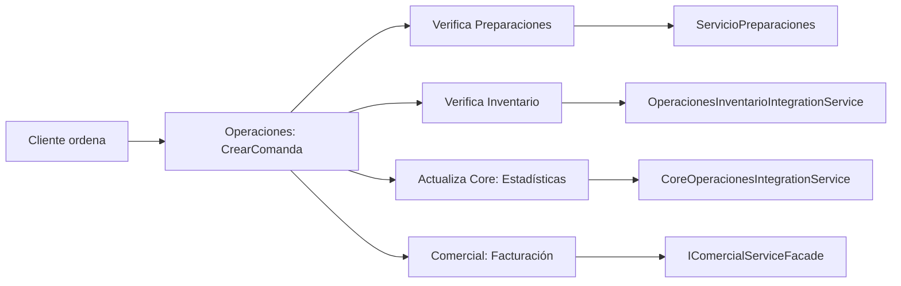

# Módulo Core/BoundedContexts - Domain (Actualizado Enero 2025)

Este módulo define y documenta los diferentes Bounded Contexts (Contextos Delimitados) del sistema RestaurantePro, así como las relaciones entre ellos mediante el Context Map (Mapa de Contextos).

## 🏗️ Estructura del Módulo

```
BoundedContexts/
├── BoundedContextsConfiguration.cs    # Configuración principal de contextos
├── ContextMap/
│   └── RestauranteProContextMap.cs    # Mapa de relaciones entre contextos
├── Catalogo/                          # [VACÍO - Integrado en Core]
├── Identidad/                         # [VACÍO - Integrado en Core]
└── README.md                          # Esta documentación
```

## 🎯 Bounded Contexts Implementados

### **✅ Core Context**
- **Propósito**: Elementos fundamentales compartidos entre todos los contextos
- **Responsabilidades**: 
  - Gestión de usuarios, roles y permisos
  - Catálogo de productos y recetas
  - Sistema de notificaciones
  - Patrones base (Result, Notification, Entity)
- **Entidades Principales**: `Usuario`, `Producto`, `Receta`, `ProductoCategoria`, `Notificacion`
- **Servicios**: `ICoreServiceFacade`, `IUsuarioService`, `IRecetaService`

### **✅ Operaciones Context**
- **Propósito**: Gestión operativa diaria del restaurante
- **Responsabilidades**:
  - Comandas y gestión de pedidos
  - Reservaciones y gestión de mesas
  - **🍳 Preparaciones diarias** (nueva funcionalidad)
  - Integración con inventario
- **Entidades Principales**: `Comanda`, `Reservacion`, `Mesa`, `PreparacionDiaria`
- **Servicios**: `IOperacionesServiceFacade`, `IServicioPreparaciones`

### **✅ Comercial Context**
- **Propósito**: Gestión comercial y relación con clientes
- **Responsabilidades**:
  - Gestión de clientes y fidelización
  - Facturación y pagos
  - Promociones y descuentos
  - Integración con proveedores
- **Entidades Principales**: `Cliente`, `Factura`, `Pago`, `TarjetaFidelizacion`
- **Servicios**: `IComercialServiceFacade`, `IServicioFacturacion`

### **✅ Inventario Context**
- **Propósito**: Control de stock y gestión de inventario
- **Responsabilidades**:
  - Gestión de ingredientes y stock
  - Movimientos de inventario
  - Órdenes de compra automatizadas
  - Políticas de stock bajo
- **Entidades Principales**: `Ingrediente`, `MovimientoInventario`, `OrdenCompra`
- **Servicios**: `IInventarioServiceFacade`, `IVerificadorStock`

### **✅ Proveedores Context**
- **Propósito**: Gestión de proveedores y contactos
- **Responsabilidades**:
  - Registro y gestión de proveedores
  - Gestión de contactos de proveedores
  - Categorización de proveedores
- **Entidades Principales**: `Proveedor`, `ContactoProveedor`
- **Servicios**: `IProveedoresServiceFacade`

## 🔗 Context Map - Relaciones Entre Contextos

### **Tipos de Relaciones Implementadas**

#### **1. Customer-Supplier (Proveedor-Cliente)**
- **Core → Operaciones**: Core provee productos y usuarios a Operaciones
- **Operaciones → Comercial**: Operaciones provee comandas a Comercial para facturación

#### **2. Anti-Corruption Layer (Capa Anti-Corrupción)**
- **Operaciones → Inventario**: `OperacionesInventarioIntegrationService`
- **Comercial → Proveedores**: `ServicioIntegracionProveedores`

#### **3. Conformist (Conformista)**
- **Core → Inventario**: Inventario se adapta al modelo de productos de Core
- **Core → Comercial**: Comercial se adapta al modelo de usuarios de Core

#### **4. Partnership (Colaboración)**
- **Inventario ↔ Proveedores**: Colaboración para órdenes de compra

#### **5. Separate Ways (Caminos Separados)**
- **Core ↔ Proveedores**: Modelos independientes con integración mínima

## 🚀 Nuevas Funcionalidades Implementadas (2024-2025)

### **🍳 Preparaciones Diarias (Operaciones)**
- **Entidad**: `PreparacionDiaria`
- **Servicio**: `IServicioPreparaciones`
- **Funcionalidad**: Flujo híbrido de preparaciones diarias + al momento
- **Integración**: Completamente integrado en `OperacionesServiceFacade`

### **🏗️ Patrones Arquitectónicos**

#### **Builders Implementados (8/8)**
| Builder | Contexto | Estado | Integrado |
|---------|----------|--------|-----------|
| `ComandaBuilder` | Operaciones | ✅ | ✅ |
| `ReservacionBuilder` | Operaciones | ✅ | ✅ |
| `MesaBuilder` | Operaciones | ✅ | ✅ |
| `FacturaBuilder` | Comercial | ✅ | ✅ |
| `ProductoBuilder` | Core | ✅ | 🔄 |
| `IngredienteBuilder` | Inventario | ✅ | ✅ |
| `OrdenCompraBuilder` | Inventario | ✅ | ✅ |
| `ProveedorBuilder` | Proveedores | ✅ | 🔄 |

#### **Factories Implementados (2/2)**
- `ClienteFactory` (Comercial) ✅
- `IngredienteFactory` (Inventario) ✅

#### **Patrones Globales**
- **Result Pattern**: Implementado en todo el dominio
- **Notification Pattern**: `INotificationManager` global
- **Specification Pattern**: Refinado y actualizado

### **🔗 Servicios de Integración**
- `ICoreOperacionesIntegrationService`: Core ↔ Operaciones
- `IOperacionesInventarioIntegrationService`: Operaciones ↔ Inventario
- `IServicioIntegracionProveedores`: Comercial ↔ Proveedores

## 📊 Implementación Práctica

### **🏛️ Organización del Código**
1. Cada contexto tiene su propia área en el proyecto (`Core/`, `Operaciones/`, `Comercial/`, etc.)
2. Las clases dentro de un contexto usan un lenguaje consistente (Ubiquitous Language)
3. Las traducciones entre contextos ocurren en los bordes mediante servicios de integración
4. Los eventos de dominio se utilizan para comunicación asíncrona entre contextos
5. El SharedKernel contiene solo lo estrictamente necesario para compartir

### **🔄 Flujo de Integración Típico**



### **📈 Métricas de Implementación**
- **Contextos**: 5 implementados
- **Entidades**: 25+ entidades principales
- **Servicios de Dominio**: 15+ servicios especializados
- **Builders**: 8 implementados con patrón fluent
- **Factories**: 2 implementados con validaciones robustas
- **Event Handlers**: 10+ para integración entre contextos
- **Specifications**: 15+ especificaciones refinadas

## 🔄 Evolución y Roadmap

### **✅ Completado**
- ✅ Implementación de todos los contextos principales
- ✅ Patrones Builder en producción
- ✅ Result/Notification patterns globales
- ✅ Servicios de integración robustos
- ✅ Preparaciones diarias implementadas

### **🔄 En Desarrollo**
- 🔄 Integración de ProductoBuilder en producción
- 🔄 Integración de ProveedorBuilder en producción
- 🔄 Optimización de caché distribuida
- 🔄 Métricas y observabilidad

### **📋 Planificado**
- 📋 Implementación de Command Query Separation (CQRS)
- 📋 Event Sourcing para auditoría
- 📋 Microservicios por contexto delimitado
- 📋 Health checks específicos por contexto

## 🎯 Principios de Diseño Aplicados

### **Domain-Driven Design (DDD)**
- ✅ Bounded Contexts claramente definidos
- ✅ Ubiquitous Language consistente
- ✅ Agregados bien diseñados
- ✅ Context Map documentado

### **Clean Architecture**
- ✅ Dependencias apuntan hacia dentro
- ✅ Dominio independiente de infraestructura
- ✅ Casos de uso bien definidos
- ✅ Interfaces segregadas

### **SOLID Principles**
- ✅ Single Responsibility aplicado a contextos
- ✅ Open/Closed con builders y factories
- ✅ Liskov Substitution en jerarquías
- ✅ Interface Segregation en servicios
- ✅ Dependency Inversion con abstracciones

---

## 🏆 Estado del Dominio: **LISTO PARA PRODUCCIÓN**

**El dominio RestaurantePro está completamente implementado y listo para la siguiente capa de aplicación. Todos los bounded contexts están operativos, los patrones arquitectónicos están implementados y las integraciones entre contextos funcionan correctamente.** 